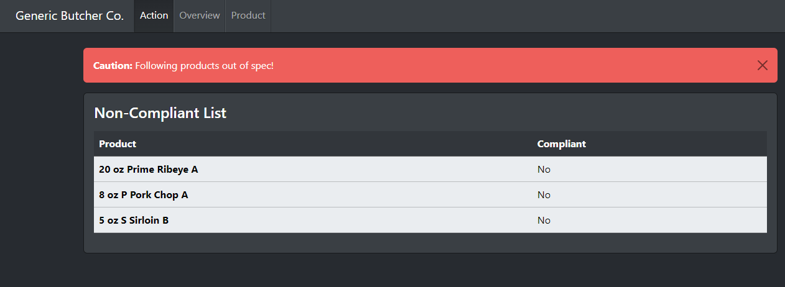
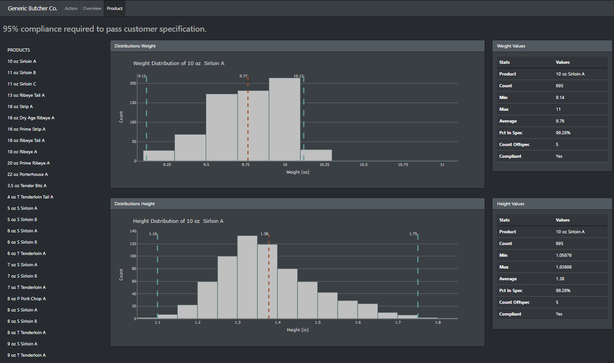

# Generic Butcher Company - Tools for Quality Control Success

[View Detailed Project Demo Video](https://saadnasir92.github.io/Generic-Butcher-Interactive-WebDashboard-with-AWS/)

## Project Overview
 We were given real life data from an industrial butcher in hopes that we could present a prototype that would streamline their camera-csv-excel-analytics pipeline. The solution is below:
- As the quality control team for an industrial butcher, we are tasked with determining:
    - Where our product lines are above 95% compliant to customer's specifications. 
    - Remove obvious errors in the data before providing it to the client.
    - Use our tool to determine where outliers or off-spec items might be explained by manual errors, camera-read errors, or non-production/operational issues
    - Provide suggestions where we should further clean data, add additional slicers for a dashboard, etc for better data-driven decision-making. 
    - Future proof the tool
    - Deploy the tool using AWS RDS (PostgreSQL) for the database, AWS Elastic Beanstalk (EBS) for the application, and GitHub Actions for CI/CD.
    
- These goals are met by: 
    - Interactive visualizations dashboard
        - Actions Page : provides a dynamic list of out of compliant products so stakeholders can focus on correction.
        - Overview Page : provides a dynamic table of each relevant metric, with action items (non-compliant) staged at the top for easy review. 
        - Products Page : provides side-by-side view of each metric, called dynamically by product in the left nav-bar. Vital statistics are called to further describe data.
    - Libraries and tools not covered in class
        - Plotly Express
        - Flask-SQLAlchemy
        - Bootswatch Slate
        - Plotly.js
        - AWS Elastic Beanstalk (EBS)
        - AWS RDS (PostgreSQL)
        - GitHub CI/CD (GitHub Actions)
    - Data stored and extracted from database
    - Group Presentation 

## Tools and Technologies

- Microsoft Excel (CSV)
- QuickDBD
- Python
- DBeaver
- AWS Solutions
- GitHub
- JavaScript
- HTML

## Project Steps
Steps are governed by the below flow-chart: 

1. Data Ingestion - Python (pandas), CSV, PostgreSQL
    - Function to take in CSV.
    - Function to clean & transform and add ID columns.

2. Data Loading - AWS RDS (PostgreSQL), Python (pandas, SQLAlchemy), CSV
    - Function to create a new DB in our RDS DB.
    - Create a function to read our table script query to create the tables.
    - Function to load into the DB (test env is local a Postgres server, production is AWS RDS Postgres server)

3. Data Transformation - Python (pandas, NumPy, plotly, matplotlib)
    - Initial testing directly from CSV, allowing us to work independently from the database ingestion team. 
    - Data analysis -- to understand data and create a punch list to transform, using Excel and Python as test environments.
    - Create multiple plot models and use as a tool to further refine cleaning and data story. 
    - Added vertical mean, and upper/lower spec lines.  
    - Stripped spaces and semi-colons, any N/A and errors.
    - Removed non-relevant data, like 
        - "test blocks"
        - Suspected water on the line -- lower outliers that didn't make sense for thickness (dropped entire rows)
        - Suspected manual entry errors (no decimal points) on weight that populated >50 lbs (multiplied by .01 to reset decimals)

4. Outlier and Error Handling -- Python (pandas, NumPy)
    - Excluding all weights over 50 by multiplying by .01-- clear decimal placement error. These are likely just human error-- forgot decimals.  
    - Removing all rows with thickness < .05in. These are likely water on the line. 

5. User Experience -- Python (pandas, Flask, NumPy), Plotly.js
    - Functions to query the data from database
    - Functions to transform based on the above
    - Function to make a descriptive chart. 
        - weight
        - thickness
    
6. Data Serving: Python (Flask, pandas, NumPy)
    - Flask
        - Create endpoints to serve html files & data as APIs for client to read.
        - Integrate internal modules to transform the data.

7. Client Processing : Python (Flask, SQLAlchemy, pandas), JavaScript, Bootstrap
    - HTML Files
        - Source bootstrap and place all elements as needed.
    - JS Files
        - Minimal JavaScript - used to fetch API endpoints and append to html

8. Debugging & Cleaning Up
    - Ensure everything works as intended. 
    - Clean up unnecessary files/folders comments, fix any code, typo, refactor variables etc. 

9. Deployment AWS EBS, GitHub CICD

## Website Views
Actions

Overview

Products

## Conclusion and Ethical Considerations 
This tool is designed with internal stakeholders in mind.  It catches issues, serves those issues succinctly, and provides the quality control team visibility into what lines they need to review.

External stakeholders should not be served this view.  They should be provided a second data-cleaning step that normalizes more complex issues. An example of these errors, is a finding where it looks like 3oz steaks were accidentally coded as 13-oz. Unless the customer then had those packed in 13-oz boxes, these are not relevant to the quality of the product. 

The project discusses the real-world problem of determining what data is and is not relevant. It further explores who the audience is, what story the data tells, and how cleaning and transforming and visualizing that data skews what insights are served.  

## Future Work
Based on client requests and stakeholder these are some future considerations for the app. 

User Experience:  
- Add quarterly view, monthly, view, weekly, daily ingestion and view
- Add outliers lists by product and date
- Add interactive callout from the action page to the product page product (or plots within the action page)
- Add password protection to the website-- landing main page
- Add different users could have different views (call different data)
- Transform data differently based on who the stakeholder is.  

Data + Reports:
- Send live-links or emails when data is uploaded to the database
- Embed radio buttons to call/ download csv reports from the website based on data and product

## Resources
 - Anonymized Dataset - original data sourced from industrial butcher production-line camera reader.  
 - Bootswatch Slate (https://bootswatch.com/5/slate/bootstrap.min.css)
 - Logo (https://ideogram.ai/t/explore)
